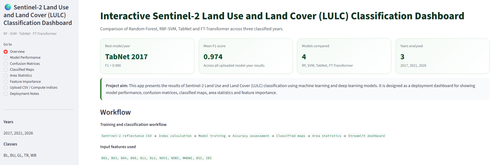

# Sentinel-2 LULC Streamlit Dashboard

This is a Streamlit deployment package for a Sentinel-2 Land Use and Land Cover (LULC) classification project. You can see the app at [https://n1386471-lulc.streamlit.app/](https://n1386471-lulc.streamlit.app/)



The dashboard compares four classification algorithms:

1. Random Forest
2. SVM
3. TabNet
4. FT-Transformer

The app displays:

- Model performance metrics
- Confusion matrices
- Classified map previews
- Area statistics
- Feature importance
- CSV upload for calculating Sentinel-2 indices

## Important note

This first deployment version is a stable dashboard. It uses CSV tables and PNG images rather than running full raster classification online. This is intentional because full GeoTIFF classification and deep learning model loading can create deployment errors, especially when `.joblib`, `.pt`, and TabNet files were created in different Python environments.

## How to run locally

Open Anaconda Prompt, Command Prompt, PowerShell, or Terminal and run:

```bash
cd path/to/sentinel2_lulc_streamlit_app
streamlit run app.py
```

## How to deploy on Streamlit Community Cloud

1. Create a GitHub repository.
2. Upload all files and folders from this package.
3. Go to Streamlit Community Cloud.
4. Select the GitHub repository.
5. Select `app.py` as the entry-point file.
6. Deploy the app.
7. Copy the Streamlit link and include it in your project report.

## Main app files

```text
app.py
requirements.txt
data/all_model_metrics.csv
data/all_area_statistics.csv
data/all_feature_importance_statistics.csv
data/class_code_mapping.csv
images/confusion_matrices/
images/classified_maps/
metadata/metadata.json
```
